# ¡Imágenes, IA y Magia Generativa! 🧙‍♂️🖼️🤖✨

¡Hola developer 👋🏻! En este directorio encontrarás un montón de pruebas/demos con las que jugar para que puedas entender mejor cómo puedes usar la inteligencia artificial para entender qué hay en una imagen, crear nuevas, componer en base a otras e incluso editarlas. También te ayudará a entender los diferentes endpoints que existen.

## Tabla de Contenidos

- [¡Imágenes, IA y Magia Generativa! 🧙‍♂️🖼️🤖✨](#imágenes-ia-y-magia-generativa-️️)
  - [Tabla de Contenidos](#tabla-de-contenidos)
  - [Introducción](#introducción)
  - [Vision 👁️](#vision-️)
    - [Usando `/v1/chat/completions` para analizar imágenes](#usando-v1chatcompletions-para-analizar-imágenes)
    - [Usando `/v1/responses` para analizar imágenes](#usando-v1responses-para-analizar-imágenes)
  - [Generación de imágenes 🖼](#generación-de-imágenes-)
    - [Usando `/v1/images/generations`](#usando-v1imagesgenerations)
    - [Usando `/v1/responses`](#usando-v1responses)
  - [Composición de imágenes 🧩](#composición-de-imágenes-)
  - [Edición de imágenes ✏️ usando máscaras](#edición-de-imágenes-️-usando-máscaras)

## Introducción

Cuando hablamos de imágenes en IA podemos referirnos a:

- **Entender imágenes** 🧐: Analizar y comprender el contenido de una imagen, como identificar objetos, personas, texto, etc.
- **Generación de imágenes** 🎨: Crear imágenes nuevas a partir de descripciones textuales.
- **Composición de imágenes** 🧩: Combinar varias imágenes para crear una nueva.
- **Edición de imágenes** ✏️: Modificar imágenes existentes, como cambiar colores, añadir o eliminar elementos.


>[!NOTE]
Para estas demos me he basado fundamentalmente en cómo funciona OpenAI por lo que algunos endpoints pueden no estar disponibles si no tienes acceso a la API de OpenAI. 


Y ahora, veamos cada uno de estos aspectos en detalle.


## Vision 👁️

El primer punto, "Entender imágenes", es lo que se conoce como **Computer Vision** o simplemente **Vision**. Esto nos permite pasarle a un modelo de IA una imagen y que este nos diga qué hay en ella. Esto es muy útil para tareas como reconocimiento de objetos, análisis de escenas, etc.

En el directorio `images` encontrarás diferentes demos que muestran cómo puedes trabajar con imágenes usando IA generativa. Pero antes de entrar en cada demo es importante que sepas que para poder analizar imágenes podemos usar dos endpoints diferentes:

- `/v1/chat/completions`: Este ya lo conoces de secciones anteriores, si has seguido mi serie de IA Generativa 😇 y es el mismo que se utiliza para generar un chat o incluso text completion.

- `/v1/responses`: Este te permite enviar una imagen y recibir una respuesta generada por un modelo de IA que ha sido entrenado para entender imágenes. Este endpoint también nos servirá para generar imágenes, componerlas, editarlas, etc.

### Usando `/v1/chat/completions` para analizar imágenes

Para analizar imágenes usando el endpoint `/v1/chat/completions`, debes enviar un mensaje que incluya la imagen como parte del contenido. En el archivo [vision/chat-completions-api/app.py](vision/chat-completions-api/app.py) encontrarás un ejemplo de cómo hacerlo, tanto pasandole una URL como la imagen en base64.

Lo bueno de este ejemplo es que puedes utilizar tanto Ollama, GitHub Models como OpenAI (entre otros) para analizar imágenes usando este endpoint. En el archivo `.env-sample` encontrarás un ejemplo de cómo configurar las variables de entorno para cada uno de ellos y en base a la sección que tengas descomentadas podrás usar uno u otro.

### Usando `/v1/responses` para analizar imágenes

En el caso de este endpoint, `/v1/responses`, es muy similar al anterior, desde el punto de vista de cómo se envía la imagen, pero la respuesta que obtendrás será diferente. Este endpoint está diseñado específicamente para analizar imágenes y generar respuestas basadas en su contenido. Además tiene un parámetro adicional `detail` que te permite decirle al modelo el nivel de detalle a usar cuando analice la imagen (`low`, `high`o `auto`). El objetivo de esto es que puedas ahorrar tokens si no necesitas un análisis muy detallado. Em el archivo [vision/responses-api/app.py](vision/responses-api/app.py) encontrarás un ejemplo de cómo usar este endpoint para analizar imágenes.

Sin embargo, este endpoint no está disponible en Ollama ni en GitHub Models, por lo que si quieres usarlo tendrás que usar OpenAI o algún otro servicio que lo implemente. Si intentas ejecutar el ejemplo de este endpoint con Ollama o GitHub Models, obtendrás un error indicando que el endpoint no se encuentra (404 Not Found).


## Generación de imágenes 🖼

Ahora que ya ️sabes cómo analizar imágenes, ahora vamos a ver cómo podemos generar nuevas.

Para este caso tenemos dos endpoints que podemos usar:

- `/v1/responses`: El mismo que vimos en la sección anterior, pero en este caso lo usaremos para generar imágenes a partir de un texto descriptivo. 

- `/v1/images/generations`: Este endpoint te permite generar una imagen a partir de un texto descriptivo. Es el más común y utilizado para crear imágenes nuevas basadas en prompts.


**¿Cuál es la diferencia entre ambos?**

El endpoint `/v1/responses` es más versátil, ya que te permite crear nuevas, editar, pero lo que realmente la diferencia es el multi turno para ir tomando como referencia las imágenes que vas generando, analizar imágenes y puedes usar modelos de caracter general como 'gpt-4o', 'gpt-4o-mini', 'gpt-4.1', etc.

 Por otro lado, el endpoint `/v1/images/generations` es más específico para la generación de imágenes a partir de un texto descriptivo aunque también puedes editar imágenes usando máscaras y prompts. Sólo permite el uso de modelos específicos para generación de imágenes como 'gpt-image-1', 'dall-e-2', 'dall-e-3', lo cual hace que sean imágenes de alta calidad pero también más caras en tokens.

 Y un endpoint no puede usar los modelos del otro, por eso que no son intercambiables.

En el directorio `images/generation` encontrarás ejemplos de cómo usar ambos endpoints para generar imágenes, componerlas y editarlas.

### Usando `/v1/images/generations`

En el archivo [generation/images-api/app.py](generation/images-api/app.py) encontrarás un ejemplo de cómo usar este endpoint para generar imágenes a partir de un texto descriptivo. Aquí se muestra cómo enviar un prompt y recibir una imagen generada por el modelo.

En este caso el endpoint solo soporta 'gpt-image-1', 'dall-e-2', or 'dall-e-3' como modelos, por lo que si quieres usar otro modelo tendrás que usar el endpoint `/v1/responses`.

El resultado será parecido a este:

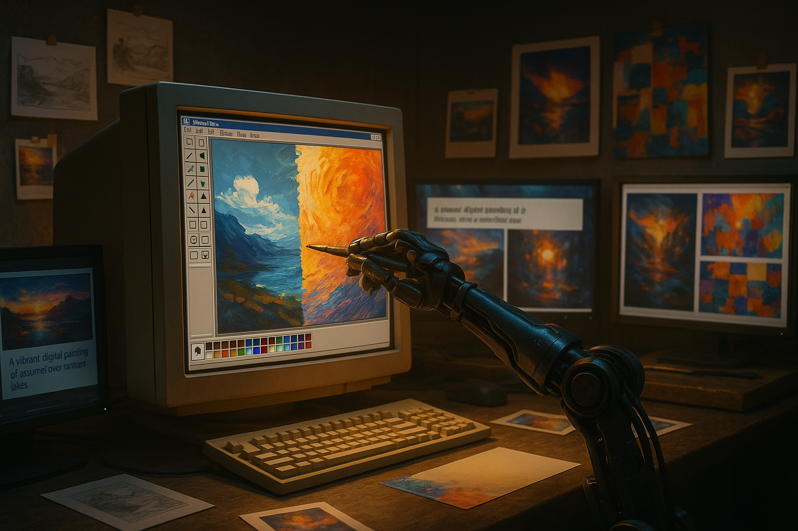


### Usando `/v1/responses`

Por otro lado, tenemos el endpoint que vimos en la sección anterior, `/v1/responses`, que también nos permite generar imágenes a partir de un texto descriptivo. Pero te permite muchas más cosas. En primer lugar soporta otros modelos:

- gpt-4o
- gpt-4o-mini
- gpt-4.1
- gpt-4.1-mini
- gpt-4.1-nano
- o3

En el archivo [generation/responses-api/app.py](generation/responses-api/app.py) encontrarás un ejemplo de cómo usar este endpoint para generar imágenes a partir de un texto descriptivo. 

Además, como parte de ese ejemplo también estoy haciendo multi-turno, lo que significa que estoy generando una imagen y luego pidiéndole al modelo que la mejore en base a esa imagen. Esto te permite ir refinando la imagen generada hasta que obtengas el resultado deseado.

De hecho, con el primer prompt le pido lo siguiente:

```
Genera una imagen hiperrealista y detallada de un caracol de cristal azul y una rana de cristal verde, que se note claramente que son de cristal, ambos situados juntos sobre un lecho de hojas y musgo en un entorno natural iluminado suavemente. 
Asegúrate de que el caracol y la rana sean claramente visibles, con texturas realistas de cristal, y que el fondo muestre vegetación y elementos naturales como piedras o ramas. 
La composición debe transmitir tranquilidad y resaltar los colores azul y verde de los animales.
```

Y me genera algo como esto:

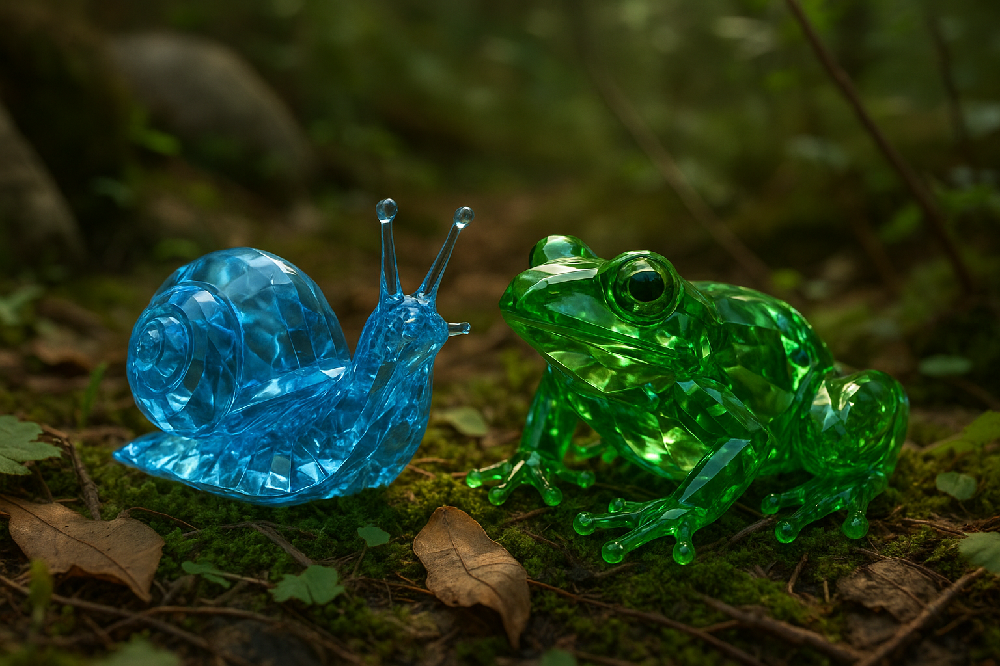

Luego, tomando esa imagen como referencia, le pido que la mejore:

```
Añade una mariposa de color amarillo, con alas abiertas también de cristal, se tiene que notar claramente, 
posada suavemente sobre una hoja cerca del caracol y la rana. 
Asegúrate de que la mariposa destaque en la composición, manteniendo la iluminación suave y el entorno natural, 
y que todos los elementos conserven un aspecto hiperrealista y armonioso.
```

Y me devuelve algo como esto:

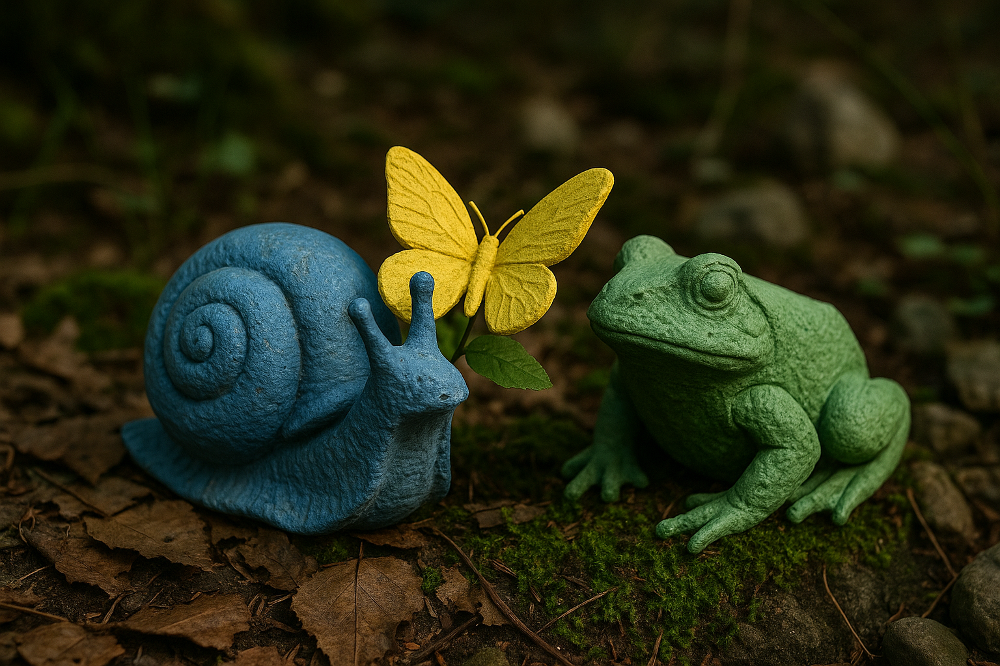

Y por último le pido que ahora quiero que los animales dejen de ser de cristal y sean reales: 

```
Transforma la escena para que tanto el caracol, la rana y la mariposa tengan un aspecto completamente realista, 
que dejen de ser de cristal y se conviertan en animales vivos, 
con detalles naturales en sus texturas y colores. Cambia el fondo a un bosque frondoso y realista, 
con árboles, hojas y luz filtrada entre las ramas, manteniendo la composición armoniosa y la iluminación suave. 
Asegúrate de que los animales se integren perfectamente en el entorno natural del bosque.
```

Y para esta última generación le pido que me devuelva parciales, por lo que primero me devuelve esto:

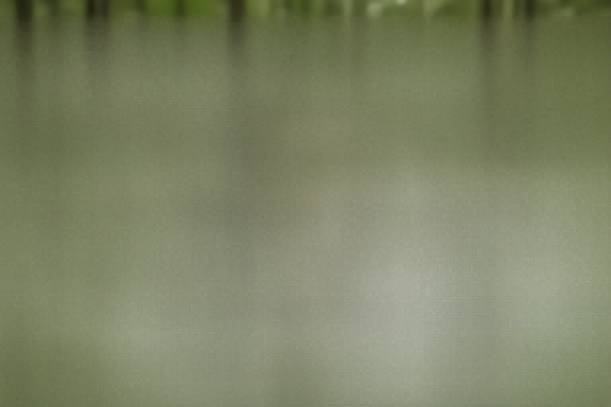

Luego esto:

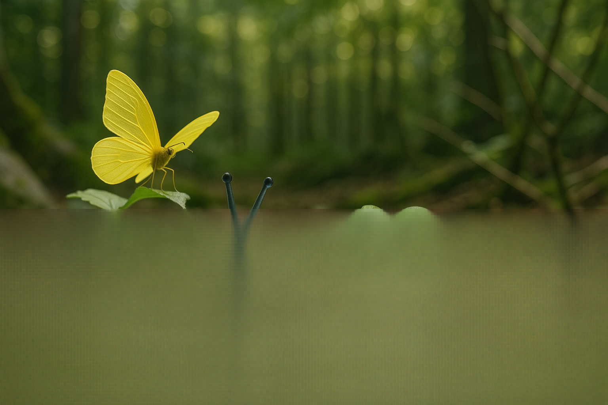

Y finalmente la imagen completa:

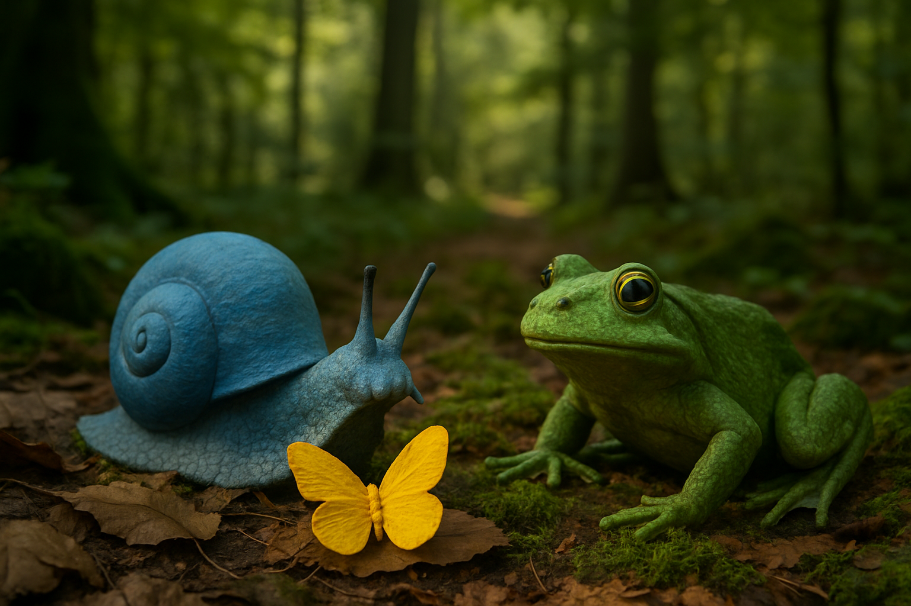

¿A que mola? 😍

## Composición de imágenes 🧩

La composición de imágenes es el proceso de combinar varias imágenes para crear una nueva. Esto puede incluir superponer imágenes, recortar partes de una imagen y pegarlas en otra, o incluso fusionar varias imágenes en una sola.

Para este ejemplo he utilizado el endpoint `/v1/responses`, ya que es el más versátil y soporta la composición de imágenes de manera más eficiente. En este sentido tengo dos demos que compartir contigo:

- Imágenes que no afecten a la moderación de la API: ¿Qué significa esto? Pues que puedes usarlas sin problemas.

Para este ejemplo he puesto como parte del repo tres objetos que forman parte mi estanteria: 

1. Un Clippo en 3D que me regaló un compañero de trabajo y que me encanta 🩶

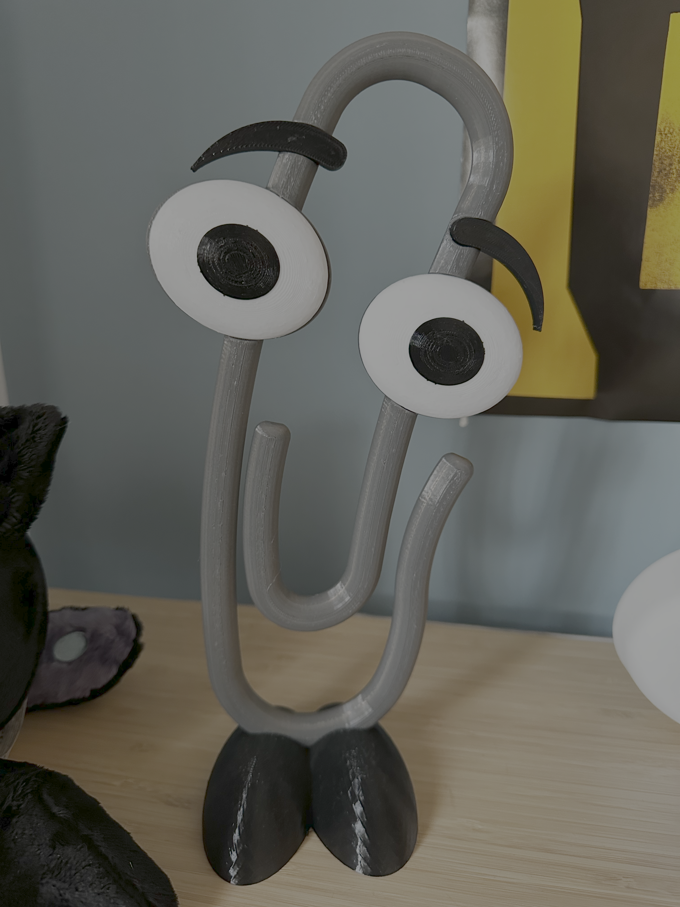

2. Peluche de Octocat

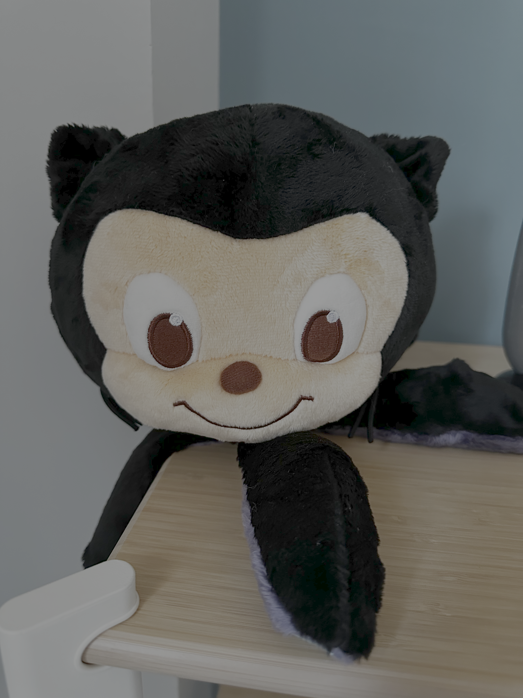

3. Un insecto hecho de hojalata que sus ojos son solares

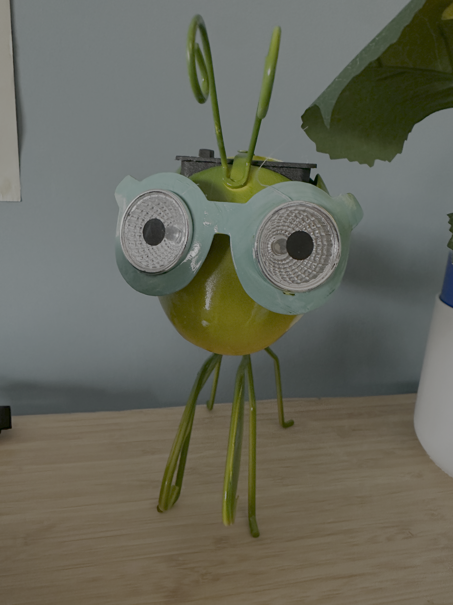

Ahora utilizando el archivo [generation/responses-api/create_image_from_others.py](generation/responses-api/create_image_from_others.py) lo único que le he pedido es:

```
Genera una foto realista donde los personajes de las imágenes están juntos en una cesta.
```

y pasándole estas tres imágenes este es el resultado:

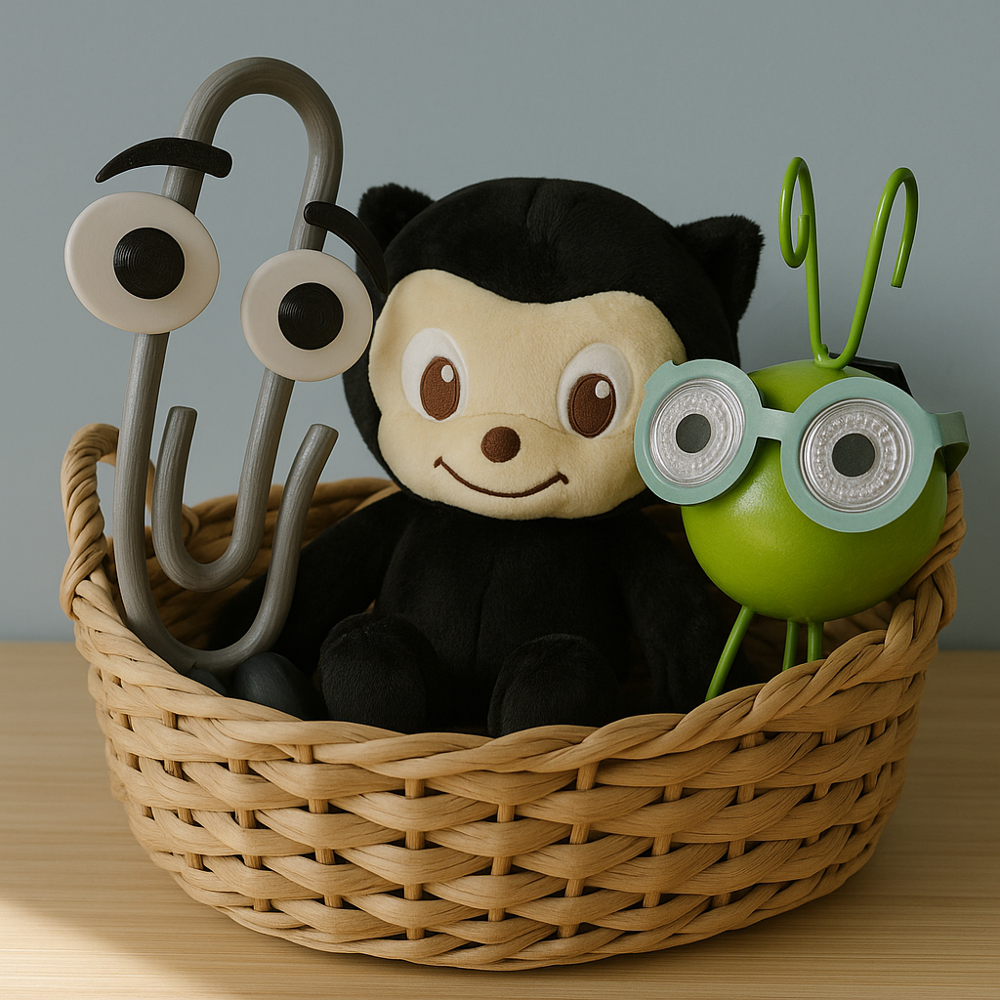

¡Mola, eh! 😍

Si le pidieramos lo mismo al endpoint `/v1/images/edits` podríamos hacerlo como se muestra en el archivo [generation/images-api/create_image_from_others.py](generation/images-api/create_image_from_others.py). Y este sería el resultado:

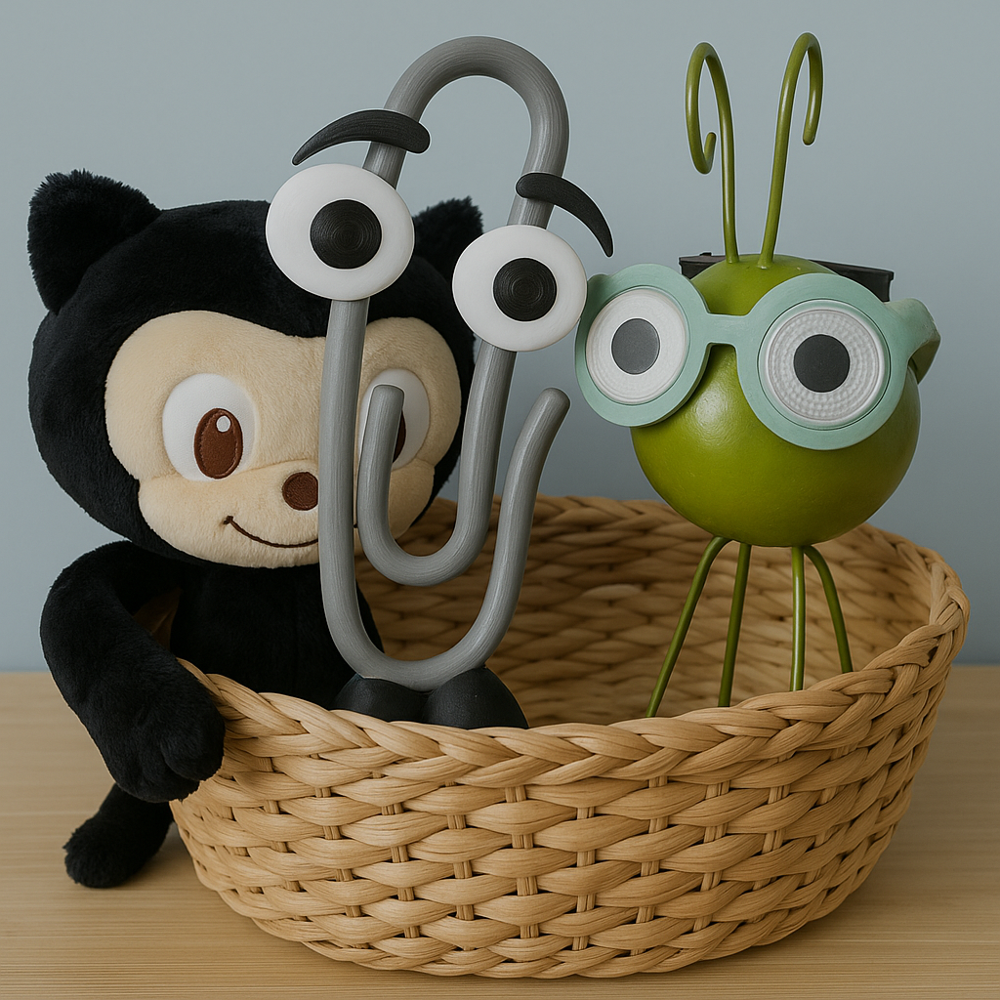

## Edición de imágenes ✏️ usando máscaras

Podría estar aquí todo el día haciendo ejemplos de cómo usar la IA generativa para editar imágenes 😱 Pero ya para finalizar quiero mostrarte un último ejemplo que sería la edición de imágenes usando máscaras que también me parece súper chulo. Para ello voy a tomar como referencia la imagen que se ha creado realista de la rana, el caracol y la mariposa:


Y lo que voy a hacer es reemplazar el caracol por algo gracioso, que lo decida la IA 😅. Para hacer esto de una forma fiable lo que voy a hacer primeramente es generar la máscara. Podría hacerlo usando cualquier programa de edición de imágenes pero voy a pedirle incluso a la IA que lo haga por mi y una vez que lo tenga la use para la imagen final.

Por lo que si ejecutas este archivo [generation/images-api/edit_with_mask.py](generation/images-api/edit_with_mask.py) verás que primero le pido que me genere la máscara de la imagen:

Lo primero que va a hacer es generar la máscara de la imagen que le he pasado:

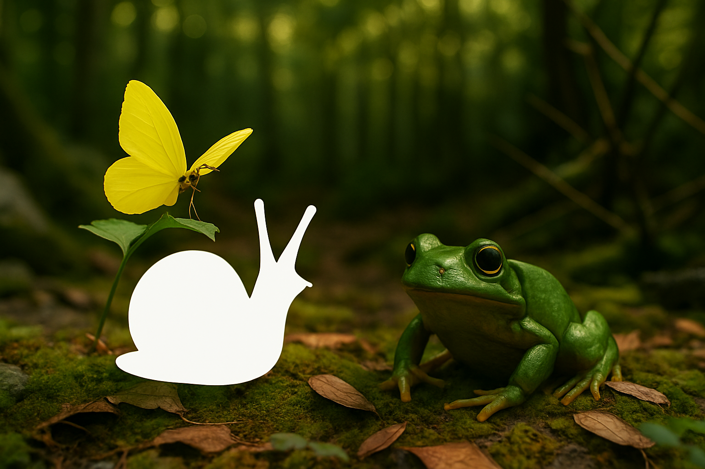


De la cual voy a crear posteriormente una nueva con el canal alfa para que la IA pueda usarla como máscara:

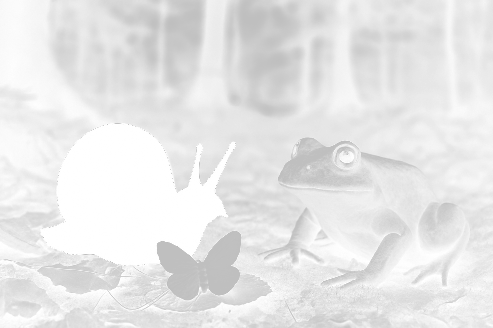

Y por último le voy a pedir que me genere una nueva imagen usando esa máscara y un prompt como el siguiente:

```
Sustituye únicamente el caracol azul en la imagen por algo divertido, 
asegurándote de que solo el caracol sea reemplazado y el fondo, 
la rana y la mariposa permanezcan exactamente igual que en la imagen original.
```

Y el resultado en mi ejecución fue este:

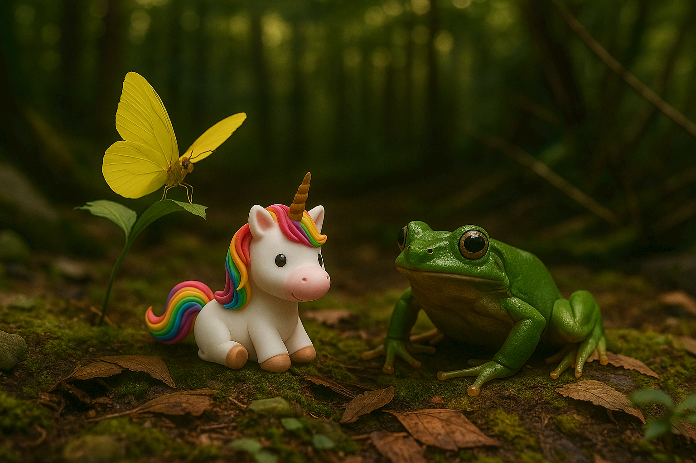

Si quisieras hacer lo mismo con el endpoint `/v1/responses` podrías hacerlo utilizando este otro archivo: [generation/responses-api/edit_with_mask.py](generation/responses-api/edit_with_mask.py). La diferencia es que en este caso no necesitas generar la máscara, ya que el modelo se encargará de hacerlo por ti. Usando la misma imagen, me ha generado esta máscara:

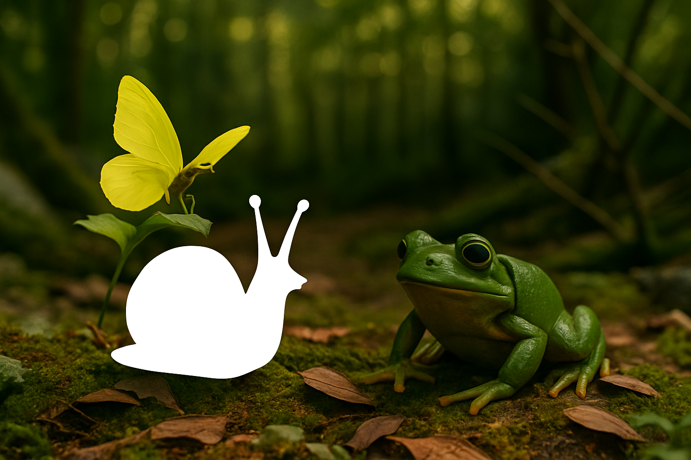

de la que sale esta con canal alfa:

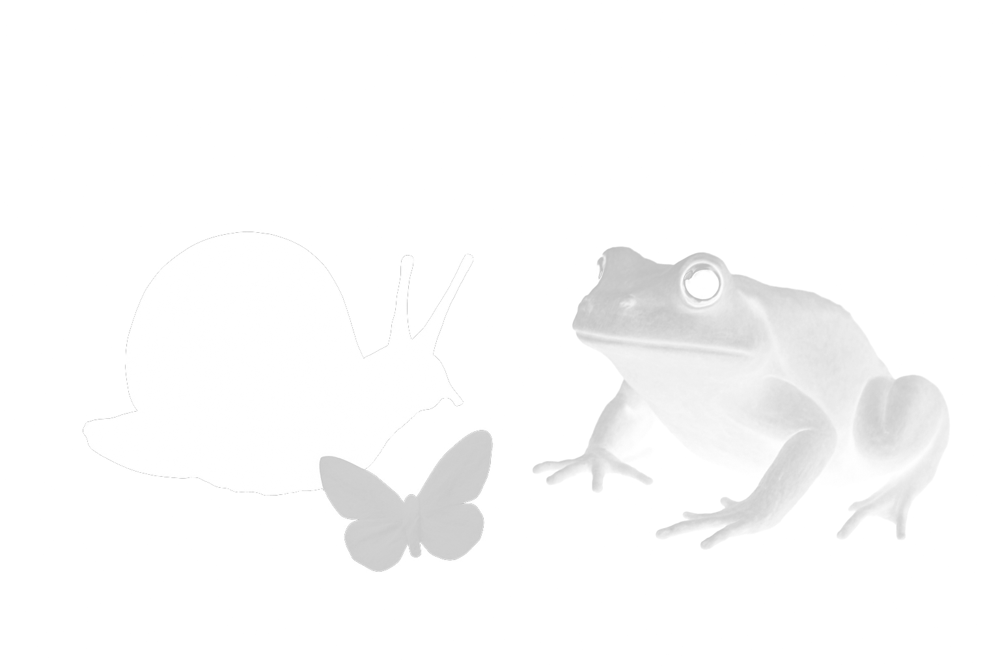

y como resultado este:

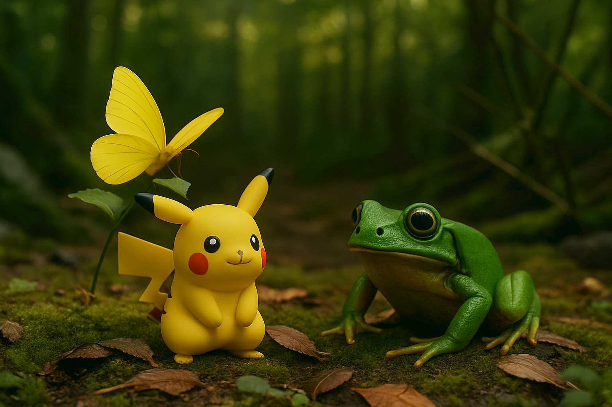


¡Y ya está! 😍

Recuerda que si quiere ver todo esto en acción puedes ver mi vídeo en YouTube donde explico todo esto y más: XXX

¡Ah! y no olvides seguirme en mis redes sociales para estar al tanto de todas las novedades y no perderte nada.


¡Nos vemos en el siguiente directorio 👋🏻!